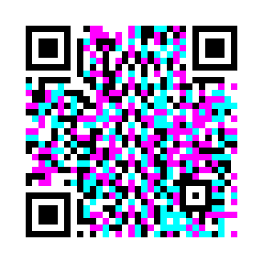
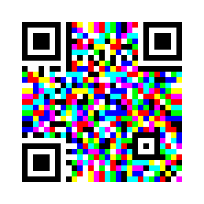

# colorqr

A Go implementation of HCC2D (High Capacity Colored 2-Dimensional code), a
QR-based 2D color barcode, with 4-color (2 bits/module) and 8-color
(3 bits/module) schemes. It follows:

> M. Querini and G. F. Italiano, "Color Classifiers for 2D Color Barcodes",
> FedCSIS 2013, pp. 611–618.

The paper is freely available from the [FedCSIS 2013 proceedings](https://annals-csis.org/Volume_1/pliks/67.pdf).

| 4 colors | 8 colors |
|:-:|:-:|
|  |  |

Both examples hold the same 80-byte text at EC level M: the 4-color one is a
version 4 symbol (33×33 modules), the 8-color one is version 3 (29×29).

## Symbol structure

As the paper describes, HCC2D keeps every QR function pattern in black and
white and puts colors only in the data and error correction area:

- **QR function patterns**, all as specified in ISO/IEC 18004: the three
  finder patterns with separators, timing patterns, alignment patterns
  (versions 2–40), the dark module, two copies of the 15-bit BCH format
  information, and two copies of the 18-bit version information (versions 7+).
  Sizes are 21×21 (version 1) up to 177×177 (version 40).
- **Color Palette Patterns**: four strips, each two modules thick, at the middle
  of the four edges. They are away from the finder patterns and from each
  other. Module *i* of a strip shows palette color *i*. The decoder reads them
  to learn how each color looked after printing and scanning.
- **Data modules**: filled in QR placement order (two-column zig-zag from the
  right). Each module carries 2 or 3 bits.

### Colors

Each bit acts as one subtractive ink (C, M, Y), so all bits clear is white and
all bits set is black. The 4-color assignment is the paper's example.

| value | 4-color | 8-color |
|------:|---------|---------|
| 0 | white | white |
| 1 | magenta | yellow |
| 2 | cyan | magenta |
| 3 | black | red |
| 4 | | cyan |
| 5 | | green |
| 6 | | blue |
| 7 | | black |

You can pass a custom palette to the encoder. The decoder needs no settings
for it, because it learns the colors from the palette patterns.

### Where this implementation departs from QR

The paper does not specify these details, so this implementation makes the
following choices.

- **Color scheme signalling.** The format information is QR's
  BCH(15,5) word. 4-color symbols XOR it with QR's mask `0x5412`; 8-color
  symbols use `0x544D`. Every 8-color format word is at least distance 5 (the
  code's covering radius) from every 4-color one, so the scheme is part of the
  protected format word and any two bit errors are still corrected. With
  three errors the decoder tries every format word within distance 3 and
  keeps the one whose data passes Reed-Solomon.
- **Masking.** This uses the eight QR mask patterns. A masked module has its
  value complemented, so each color is swapped with its opposite: white↔black,
  cyan↔magenta. The QR penalty rules pick the mask. Rules 1 and 2 (runs and 2×2
  blocks) count identical colors. Rules 3 and 4 (finder-like patterns, dark
  balance) look at the luma-binarized symbol, since that is what finder
  detection sees.
- **Error correction.** Reed-Solomon over GF(256) with the QR polynomial and
  generator. The decoder uses Berlekamp-Massey, Chien search and Forney, so it
  corrects errors at unknown positions. Colored modules hold more codewords
  than QR's tables assume, so the block layout is derived from the symbol's
  real codeword count. It uses blocks of at most 255 bytes with equal parity
  per block, interleaved as in QR. The parity share per level matches QR:

  | level | parity | correctable byte errors |
  |:-----:|-------:|------------------------:|
  | L | 20% | ~10% |
  | M | 38% | ~19% |
  | Q | 55% | ~27% |
  | H | 65% | ~32% |

  The paper measured a 9.7% byte error rate at the 90th percentile for K-means
  on scanned prints. That is why level L (the zero value) is the default.
- **Data encoding.** A single QR byte-mode segment (`0100`), terminator and
  `0xEC`/`0x11` padding. The character count is always 16 bits, because color
  symbols pass QR's 8-bit limit for versions 1–9.

### Capacity (bytes, EC level L)

| version | QR | 4-color | 8-color |
|--------:|---:|--------:|--------:|
| 1  | 17 | 32 | – |
| 10 | 271 | 543 | 807 |
| 40 | 2,953 | 5,931 | 8,891 |

Version 1 has no room for the 8-color palette patterns, so 8-color symbols
start at version 2. Call `colorqr.Capacity(version, scheme, level)` for other
combinations.

## Decoding

1. Binarize the image by luma (Otsu threshold) and find finder patterns by
   their 1:1:3:1:1 run ratio. Each candidate is cross-checked horizontally,
   vertically and diagonally.
2. Pick the three finders that form a right isosceles triangle. That gives
   the orientation, which works for any rotation.
3. Map module coordinates to pixels with the affine transform that the three
   finder centers define. Estimate the version from the finder spacing and
   confirm it with the version information and the checks below.
4. Read the format information (EC level, mask, color scheme).
5. Average each palette color over its eight palette-pattern modules. Then
   classify the data modules with **K-means seeded by those colors** in YUV
   (the paper's best classifier) or with the **minimum Euclidean distance**
   baseline.
6. Unmask, de-interleave, run Reed-Solomon correction, and parse the segment.

The tests check decoding under 90°/180°/270° and arbitrary rotations,
scaling, 2 px modules, Gaussian noise, a simulated print-and-scan color cast
with uneven lighting, JPEG compression, and randomly recolored modules.

The transform is affine, so strong perspective distortion (a phone photo
taken at a steep angle) is not handled yet. The next step would be a
homography refined with the bottom-right alignment pattern, as QR readers do.

## CLI

```sh
go build -o colorqr ./cmd/colorqr

colorqr encode -o hello.png "Hello, color QR!"          # 4 colors, EC L
colorqr encode -colors 8 -ec M -o data.png < file.bin  # 8 colors, EC M
colorqr encode -version 10 -module 4 -o big.png "hi"   # force a larger symbol
colorqr decode -v hello.png                            # prints symbol info to stderr
colorqr decode -classifier euclidean -o out.bin data.png
```

## Library

```go
import "git.foxden.network/FoxDen/hcc2d/pkg/colorqr"

// Encode to PNG.
err := colorqr.Encode(w, data, &colorqr.EncodeOptions{
	Scheme: colorqr.EightColor,
	Level:  colorqr.ECMedium,
})

// Or build a symbol and render it yourself.
sym, err := colorqr.NewSymbol(data, nil)
img := sym.Image(8, 4) // 8 px per module, 4-module quiet zone

// Decode from any PNG, JPEG or GIF (or an image.Image with DecodeImage).
res, err := colorqr.Decode(r, nil)
fmt.Println(res.Version, res.Scheme, res.Level, res.Corrected, string(res.Data))
```

## Tests

```sh
go test ./...          # full suite, including every version for both schemes
go test -short ./...   # quicker subset
```

## License

Licensed under the [GNU Affero General Public License v3.0](LICENSE) (AGPL-3.0-or-later).
